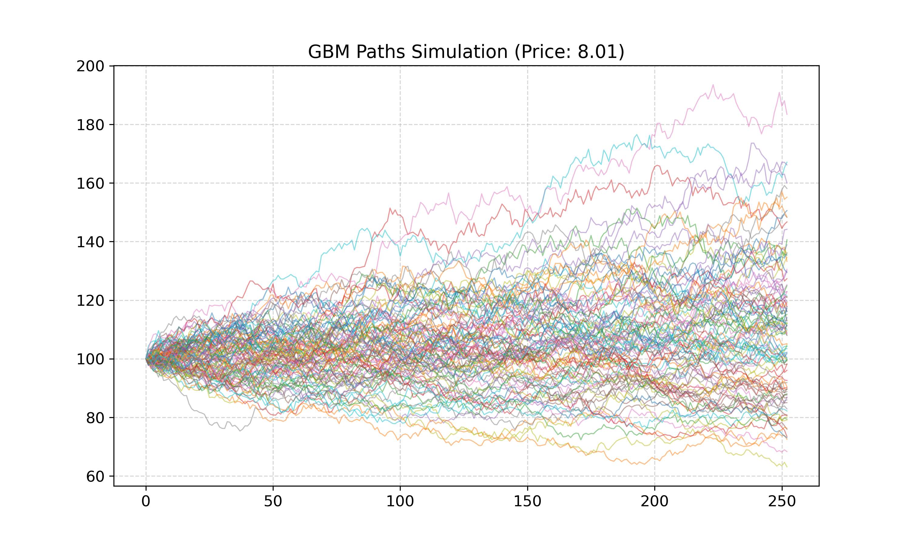
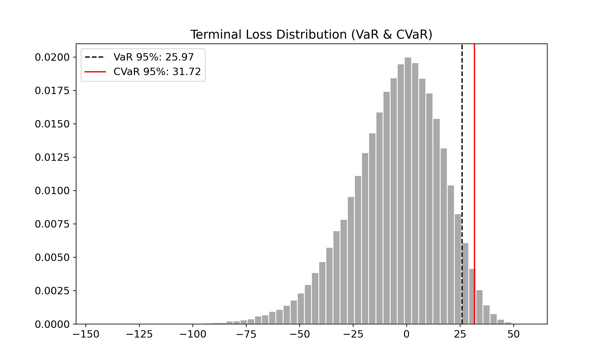
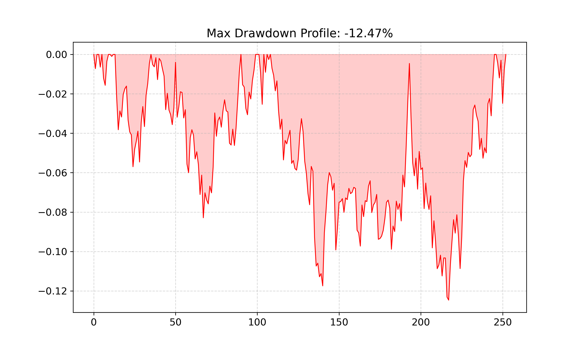
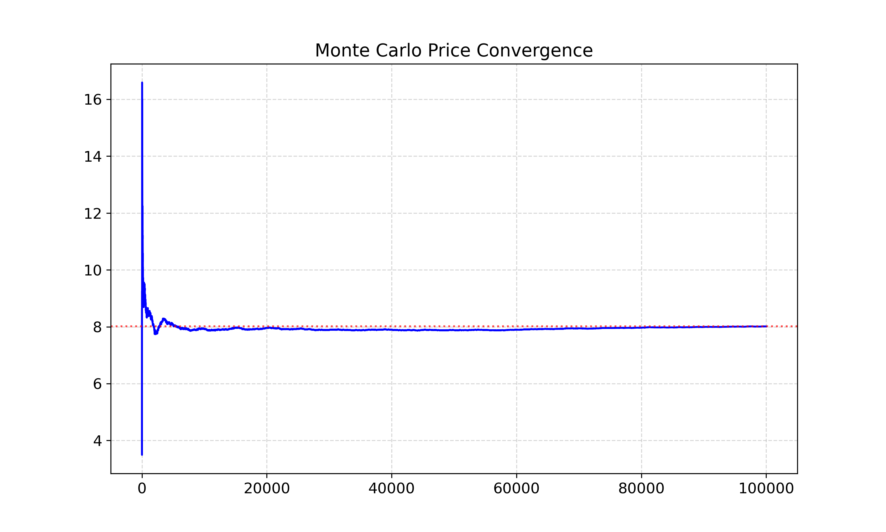

# Geometric Brownian Motion: Pricing & Risk Framework

This project implements a high-performance simulation engine to model stock price behavior and evaluate financial risk. By combining **Geometric Brownian Motion (GBM)** with **Monte Carlo methods**, it provides a robust toolkit for pricing European options and quantifying extreme market risks.

---

## 1. What is Geometric Brownian Motion?

GBM is a stochastic process widely used to model the behavior of stock prices over time. It assumes:
* **Constant drift**: The average expected return.
* **Constant volatility**: The degree of price fluctuation.
* **Log-normal distribution**: Prices cannot drop below zero.

It is the core building block for the **Black-Scholes model** and the foundation for simulating thousands of possible market outcomes.

---

## 2. How Geometric Brownian Motion Works

GBM assumes that stock prices grow continuously over time but with inherent randomness. The model captures both the average growth (drift) and the market shocks (volatility).

The price $S$ at time $t+\Delta t$ is calculated using the following equation:

$$S_{t+\Delta t} = S_t \exp\left(\left(\mu - \frac{1}{2}\sigma^2\right)\Delta t + \sigma \sqrt{\Delta t} Z\right)$$

**Where:**
* **$S_t$**: Current stock price.
* **$\mu$**: Annualized drift (average return).
* **$\sigma$**: Annualized volatility (risk).
* **$\Delta t$**: Time step (e.g., $1/252$ for daily steps).
* **$Z$**: A random value drawn from a standard normal distribution $\mathcal{N}(0, 1)$.

This formula ensures that while we expect growth over time, prices bounce around in unpredictable, realistic ways.

---

## 3. Market Risk & Performance Analysis

### 3.1 Asset Price Diffusion
Visualizing the range of potential future prices over the time horizon. The paths illustrate how uncertainty expands as the time to maturity increases, providing a visual representation of the variance in terminal payoffs.

### 3.2 Downside Risk (VaR & CVaR)
To evaluate the risk of an option or a long position, we analyze the terminal loss distribution:
* **Value at Risk (VaR 95%)**: The threshold loss that is not exceeded in 95% of cases.
* **Conditional VaR (CVaR)**: The average expected loss in the worst 5% of scenarios, capturing "fat-tail" risks that standard VaR might overlook.

### 3.3 Maximum Drawdown Profile
This chart tracks the largest peak-to-trough decline across trajectories. It serves as a proxy for liquidity risk and margin call stress during the life of the asset, highlighting the path-dependency of risk.

---

## 4. Numerical Validation
A Monte Carlo simulation is only as reliable as its statistical stability. This section validates the estimator's accuracy.

### 4.1 Monte Carlo Convergence
The plot below demonstrates the Law of Large Numbers. The estimated option price stabilizes as the number of simulations increases, ensuring that the results are statistically significant and have reached a sufficient level of precision for financial decision-making.

